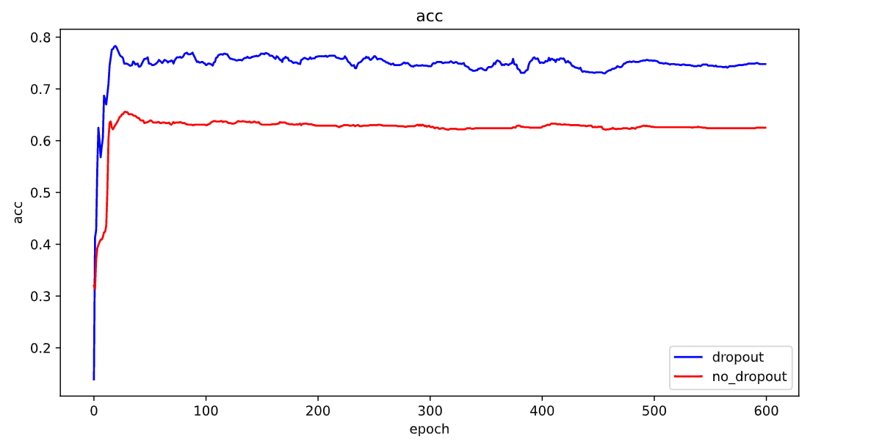

# Graph Convolutional Networks
This is pytorch implementation of Graph Convolutional Networks for tassk of(semi-supervised) classification of nodes in a graph, as described in paper:
Thomas N. Kipf, Max Welling, Semi-Supervised Classification with Graph Convolutional Networks (ICLR 2017)
# Requirements
- pytorch 1.11.0+cpu
- python 3.10.2
# Result
官方实现的GCN存在一个bug,就是对test nodes 进行了排序,关于该bug的讨论如下
https://github.com/tkipf/gcn/issues/76
  